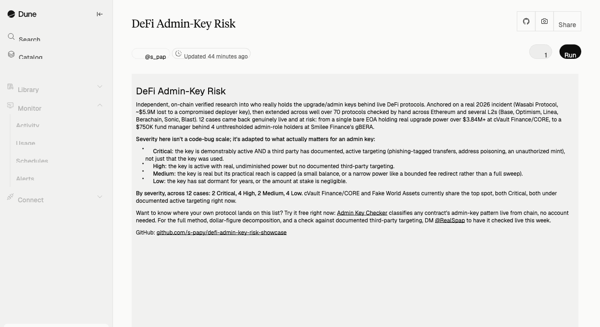

# DeFi Admin-Key Risk Scanner

**The headline finding:** across 70+ DeFi protocols checked on-chain, several risk repeating Wasabi Protocol's $5.9M loss: a bare EOA over $3.84M+ at cVault Finance/CORE, and $750K at Smilee Finance's gBERA behind 4 unthresholded admins.

[Full findings below](#what-it-found-checked-by-hand) · [Live dashboard](https://dune.com/s_pap/defi-admin-key-risk) · [Contact for licensing / custom research](https://x.com/RealSpap)

Independent, on-chain verified research into who really holds the upgrade/admin keys behind live DeFi protocols, anchored on a real 2026 incident, plus a check that finds the same pattern elsewhere.

Live dashboard: click through for the interactive version.

## At a glance

Every case below is described in full, with sources, in [What it found, checked by hand](#what-it-found-checked-by-hand). Defect types build on the categories defined in [Method](#method), with a short qualifier added where the case itself has one (a wrapper contract, a dormant key). Every dollar figure here is copied as-is from that section; nothing here is a new calculation.

Severity is not a code-bug scale, so the usual Critical/High/Medium/Low vocabulary is adapted to what actually matters for an admin key: **Critical** = the key is demonstrably active and there is documented evidence that a third party has actively targeted it (phishing-tagged incoming transfers, address poisoning, or an unauthorized/malicious mint), not merely that the key has been used. **High** = the key is demonstrably active and holds real, undiminished power, but no third-party targeting has been documented; ordinary use by the project's own team, however risky the setup, falls here rather than Critical. **Medium** = the key or role is real but its practical reach is limited, either by a small amount at stake or by narrow on-chain powers (a bounded fee redirect rather than a full sweep). **Low** = the key has been dormant for years, or the amount at stake is negligible.

| Protocol | Defect type | Amount at risk | Severity |
|---|---|---|---|
| Aurus (TXAU/TXAG/TXPT) | Bare EOA | ~$900K (real market cap) | High |
| cVault Finance / CORE | Bare EOA | $3.84M+ | Critical |
| Smilee Finance / gBERA | AccessControl, multi-holder, no threshold | ~$750K | High |
| DELTA LSW (cVault legacy) | Bare EOA (via wrapper contract) | ~$36K | Medium |
| Fake World Assets / FWA | Bare EOA | No dollar figure (risk is future proceeds routing, not funds already parked; the contract itself holds ~$160) | Critical |
| UwU Lend | Bare EOA | $48,000 to $62,000 | High |
| JayPeggers | Bare EOA | ~$188,460 | Medium |
| APY Finance | 1-of-N Safe | ~$51,300 (of which ~$18,500 sits directly in the Safe) | High |
| DeFIL | Bare EOA, dormant | No dollar figure | Low |
| ChickenSwap | Bare EOA, dormant | ~$150.57 (pool liquidity) | Low |
| MiniSwap | Bare EOA, dormant | ~$277.41 (pool liquidity) | Low |
| Mars Poolin | Bare EOA, dormant | ~$0.10 (pool liquidity) | Low |

By severity: 2 Critical, 4 High, 2 Medium, 4 Low, across the 12 cases above. cVault Finance/CORE and Fake World Assets currently share the top spot: both Critical, both under documented active targeting right now, not just theoretically exposed.

A few of these severity calls (Aurus, cVault Finance/CORE and FWA, DELTA LSW and JayPeggers, APY Finance) are not obvious from the number alone; see each case's own section below for the reasoning.

## What happened

On 2026-04-30, Wasabi Protocol lost ~$5.9M across Ethereum, Base, Berachain and Blast after an attacker compromised the private key of `wasabideployer.eth`. That single key held unchecked admin authority over every one of Wasabi's upgradeable vaults, with no multisig and no timelock. The protocol's own framework supported a timelock; it was just set to 0.

Compromised admin/deployer keys have overtaken smart-contract bugs as the #1 cause of DeFi losses: about 15% of incidents, but roughly 76% of dollars lost, because one key can drain everything a protocol's upgrade logic touches.

## Access to the tool

The verification method behind this research runs on demand, replayed fresh against any protocol you name, not published in this repository, so a case checked days or weeks ago can read differently today: admin keys get rotated, renounced, or compromised on-chain, not because the method has gone stale. Want to check one yourself right now, free? [Admin Key Checker](https://realspap.github.io/tools/admin-key-checker.html) classifies any contract's admin-key pattern live from chain, in your browser, no account needed. For the full method, dollar-figure decomposition, and a check against documented third-party targeting, reach out via [RealSpap on X](https://x.com/RealSpap) to have it checked live this week.

## Disclaimer

This research analyzes publicly available on-chain data specific to admin-key risk (smart contract code, multisig signer sets, governance transactions). None of the protocols named above were contacted prior to publication; every finding rests solely on that public on-chain data, not private communication. Full disclaimer, licensing, and program-wide notes: [methodology](https://realspap.github.io/methodology.html).

## Method

Checks the two most common real-world admin patterns, a single-address getter (`owner()`/`admin()`) and OpenZeppelin's standard `AccessControl`, and reports what actually holds that power today:

- **Renounced (0x0)**: nobody can call it. Immutable. The safe end of the spectrum.
- **Bare EOA**: a plain wallet, zero contract code. One leaked or phished key from total loss.
- **1-of-N Safe**: a real Gnosis Safe, but with a single signer. A multisig in name only.
- **Real multisig / Safe with threshold ≥ 2**: genuinely distributed control.
- **Other contract**: a Timelock or custom governance module, needing a manual look at who can actually propose into it.

## What it found, checked by hand

Well over 70 protocols have now been checked manually across Ethereum and several L2s (Base, Optimism, Linea, Berachain, Sonic, Blast): the original ~25, plus a second pass focused on smaller, newer, zero-audit protocols pulled directly from DefiLlama's own listings. Most came back clean, see below. Several came back genuinely live and at risk, beyond the Wasabi anchor.

### Aurus (tokenized gold/silver/platinum)

`owner()` on all three of Aurus's real value-bearing tokens, TXAU (tGOLD), TXAG (tSILVER) and TXPT (tPLATINUM), resolves to the same bare EOA (`0x795B8dc0...`). This isn't theoretical: that EOA has actually executed "Owner Mint" transactions against these contracts, tagged as such by Etherscan.

One correction worth flagging on its own: DefiLlama prices Aurus's TVL at the tokens' intended gold/silver peg (~$7.9M). The tokens' real, observed on-chain trading price is far lower: TXAU trades at $11.42 against an implied peg value of $142, TXAG at $0.51 against $2.13. Real, observable market cap is closer to **$900K**, not $7.9M. Either the peg has broken down or liquidity is too thin to enforce it. Either way, the admin-key risk is real but the headline TVL number is not.

### cVault Finance / CORE (est. 2020)

Seven separate proxy contracts, CoreVault, CLEND, CoreDEX Treasury, wCORE, cBTC, coreDAI and FannyVault, all resolve `owner()` to the identical bare EOA (`0x5A16552f...`). More importantly, each proxy's actual upgrade admin was confirmed live (by calling `admin()` impersonated as the suspected admin contract, since transparent proxies only reveal the real admin to the admin itself, so this isn't a guess): all seven point to the same "Team Proxy Admin" contract, which is itself owned by that same EOA. The `CLending.sol` source on cVault Finance's own GitHub hardcodes it directly: `require(msg.sender == 0x5A16552f..., "BUM")`.

Real money, decomposed token-by-token rather than trusted from a block explorer's aggregate: **at least $3.84M**, most of it in CoreDAO and DAI, both cross-checked against two independent price sources. This required throwing out most of what Etherscan's own "token holdings" widget showed for some of these contracts. CLEND's page listed $2.92M across 18 tokens, but 15 of those are spam airdrops with fabricated prices ("Visit usd-coin.net to claim rewards" at ~4,000 units, and similar). Only ~$1.56M of that specific figure is real.

The same deployer wallet personally holds $54M+ in ETH and $15M+ in tokens, a $69M+ target, and has recently received transactions tagged `Fake_Phishing` by Etherscan, plus at least two address-poisoning attempts (lookalike addresses sending dust, hoping a future copy-paste picks the wrong one from transaction history). This is not a theoretical risk being described after the fact. It's a wallet under active attention today.

One honest counter-example from the same team: DELTA, a related product line, is secured by a genuine 2-of-4 Gnosis Safe. Whoever built cVault Finance knows how to set up a multisig. They just never did it for the CORE contracts.

### Smilee Finance / gBERA (Berachain, launched 2025)

The actual fund-holding contract (GBeraAssetManager, found via DefiLlama's own TVL adapter code, not guessed) uses `AccessControl`. Its `DEFAULT_ADMIN_ROLE` currently has **4 holders**: two bare EOAs, a 1-of-1 Safe, and one genuine 2-of-5 Safe. The real multisig doesn't help, since `AccessControl` roles have no threshold, so any single holder can act alone, including revoking the real multisig's own access. One of the bare EOAs is also, separately, the sole signer behind a different 1-of-1 Safe elsewhere in the same protocol's stack.

Decomposed rather than quoted from DefiLlama's dashboard: GBeraAssetManager (`0x3F7755...eBcE` on Berachain, itself an EIP-1967 proxy) reports `totalAssets()` of **4,102,552 WBERA**.

| | |
|---|---|
| **Total value** | **~$750K** (WBERA/USD averaged from CoinGecko at $0.183385 and DefiLlama's coins API at $0.182396, both within 0.5% of each other, cross-checked against a Kodiak/BeraSwap on-chain pool price in the same $0.182-$0.183 band) |
| **Sitting directly at the address** | ~3,856 WBERA plus 34 native BERA, roughly $712 total (direct `balanceOf`/`eth_getBalance` result) |
| **The rest (~4.10M WBERA)** | not missing or fabricated: disassembling the proxy's bytecode shows it calling Berachain's own canonical validator deposit contract (`depositContract()` resolves to `0x4242...4242`, the chain's `BeaconDepositContract`) plus validator-commission and node-data functions, meaning it's real value actively staked with validators under this manager's direction, not idle tokens in one wallet |
| **Access control** | sits behind the same 4-holder `AccessControl` set described above |

Small TVL, exactly the range where this kind of gap tends to survive unnoticed.

### DELTA LSW: the one loose end from the first pass, now closed

The original version of this research flagged cVault Finance's DELTA LSW contract as using "a non-standard access scheme this couldn't identify," genuinely unknown, not assumed safe. It's no longer unknown. `DELTA_FINANCIAL_MULTISIG` (the variable name implies a multisig) is checked by an `onlyMultisig()` modifier that is really just `require(msg.sender == DELTA_FINANCIAL_MULTISIG)`, a single address, no threshold, despite the name. That address resolves to a small contract literally called `Fixer`, deployed by the same cVault Finance EOA already named above, and `Fixer.owner()`, a plain `onlyOwner`, is that identical EOA. Two layers of naming that both suggest a multisig, and neither one is. The contract still holds real value (~$36K, mostly WETH), dormant since 2022.

### Fake World Assets / FWA (zero audits, live 2026)

`owner()` on the FWA token resolves to a bare EOA tagged `tokenworks.eth` on Etherscan, matching the project's own declared Twitter handle (`token_works`) on DefiLlama, so this is the team's own key, not a stranger's. The verified source shows that same owner can redirect where purchase proceeds go (`setDistributor`, `setPool`, `setRouteSplit`) and holds a `payable launch()` function: real control over fund routing, not a cosmetic setting. The FWA token contract itself holds negligible value directly (checked via `eth_getBalance` and `balanceOf`: 0 ETH, 0 WETH, ~$160 in USDC), so the risk here is entirely about redirecting where future proceeds flow, not funds already parked in the contract.

This is a live wallet, not an old one: 2,227 transactions, most recent three days before this check, holding ~997 ETH and ~$400K of FWA personally. It has also recently received transfers from addresses Etherscan tags `Fake_Phishing`, the same "active target" pattern already seen with cVault Finance's deployer wallet, on a completely unrelated project. DefiLlama records zero audits for FWA.

### UwU Lend (fork of Aave, hacked once already)

The UwU governance/reward token's `owner()` is a bare EOA tagged `sifu.eth`. That identity is already public record, not something uncovered here: multiple outlets (CoinDesk, Unchained, Protos) have reported "Sifu" as Michael Patryn, co-founder of the collapsed QuadrigaCX exchange, doxxed by on-chain investigator ZachXBT in January 2022. Patryn launched UwU Lend in 2022. The protocol lost roughly $19.4M in June 2024 to an oracle-manipulation exploit, a different vulnerability class than the one described here, already extensively covered by security firms at the time.

What's new: more than a year after that public hack, the same single EOA still holds `onlyOwner` access to `addMinter` / `addBurner` on the UwU token, unrestricted power to mint new UwU or burn anyone's balance. The token's own market value is small today, and now priced from two independent points rather than one: **$48,000 to $62,000** depending on source (CoinGecko's $0.00299935, a snapshot about 26 days old when checked, versus $0.003860 read directly off the UwU/WETH Sushiswap pool's live reserves, both against the confirmed 16,000,000 total supply). That pool itself holds only about $1,256 of real two-sided liquidity, so neither number is fully extractable at once, which isn't really the point. The governance of this protocol was never rebuilt after a $19M+ incident that made international crypto news.

### JayPeggers: the same defect, a much smaller blast radius

`owner()` on the JAY token is a bare EOA. A bonding-curve design means the ETH itself sits in the contract, pricing buys and sells against its own balance, re-confirmed here with a direct `eth_getBalance` call down to the last wei.

| | |
|---|---|
| **Balance held** | 76.338649208883439422 ETH, worth **~$188,460** (ETH/USD averaged from CoinGecko at $2,468.75 and DefiLlama's coins API at $2,468.79, essentially identical) |
| **Owner's real power** | narrow: `setFeeAddress` and `setSellFee`/`setBuyFee` redirect roughly a 3% cut of each trade, with the sell fee only ever allowed to move in the user's favor |
| **What the owner can't do** | sweep the full ETH balance directly; reading the full source rather than just grepping for `onlyOwner` finds no function for that |
| **Why it's included** | same missing-multisig pattern as the cases above, but a genuinely smaller amount of damage a compromised key could actually do |

### APY Finance: a "1-of-N Safe" made concrete

This project's own methodology (above) names "1-of-N Safe: a real Gnosis Safe, but with a single signer" as a distinct risk category. Here's a live example.

| | |
|---|---|
| **Signers** | 6 named addresses (confirmed directly via `getOwners()`) |
| **Threshold** | 1 of 6: any single signer can act alone, the other five exist on paper only for this purpose |
| **Token value** | **~$51,300**, decomposed against the verified `totalSupply()` (100,000,000 APY) instead of quoted from a single aggregator (CoinGecko at $0.00051303 and DefiLlama's coins API at $0.00051309, both live, cross-checked against a real Uniswap ETH pool holding $13,075 of liquidity at essentially the same price) |
| **Held directly by the Safe** | 36,101,859 APY (confirmed with a direct `balanceOf` call), more than a third of total supply, worth roughly $18,500 at the same price, movable by any one of the six signers today with one signature, on top of whatever `onlyOwner` powers the token contract grants over the rest |

The point here is the pattern, not the amount, but the amount is real too.

### A cluster of abandoned keys

Not every bare-EOA finding is a live target. DeFIL (a Filecoin-lending Compound fork), ChickenSwap, MiniSwap and Mars Poolin all resolve their owner/admin to a bare EOA that hasn't moved in years: DeFIL's since May 2022, ChickenSwap's and MiniSwap's since 2020. None show any sign of being actively watched or targeted the way FWA's or cVault's wallets are. Worth naming as its own category: an admin key nobody has touched in half a decade is a different, quieter kind of risk than one an active team still uses. If it's ever compromised, or the original holder loses access, there is no one left paying attention to react.

All four were pushed to a real dollar figure, or to a documented reason one cannot exist, the same bar as everywhere else in this research. Reserves and pool status were checked directly against each contract, not inferred from an aggregator (DexScreener's own indexer missed the three live pools below entirely):

| Protocol | Reserves checked | Live DEX pool vs WETH? | Dollar figure | Why |
|---|---|---|---|---|
| DeFIL | 50,648 eFIL, 182,288 mFIL, 3,102 FILST (via Unitroller `getAllMarkets()`) | No, `getPair()` returns the zero address for all three | None | see note below |
| ChickenSwap | pool liquidity only | Yes, found via the factory directly | ~$150.57 (pool liquidity) | CoinGecko's cached price is 458 days stale, see note below |
| MiniSwap | pool liquidity only | Yes, found via the factory directly | ~$277.41 (pool liquidity) | CoinGecko's cached price is 535 days stale, see note below |
| Mars Poolin | pool liquidity only | Yes, found via the factory directly | ~$0.10, ten cents (pool liquidity) | Same live-pool method; the pool is nearly empty |

Of these four, DeFIL alone carries no dollar figure: CoinGecko's cached prices for eFIL ($5.65) and FILST ($0.84) are frozen since 2022-06-29 and 2022-05-26 respectively (against native FIL's real price of ~$0.85 today, the same peg-vs-reality gap already documented for Aurus), mFIL has no CoinGecko price at all, and DefiLlama's coins API does return a live-looking $0.51 for FILST, but with no DEX pool behind it anywhere and no corroborating second source, so that number doesn't clear this project's two-source bar.

For ChickenSwap and MiniSwap, those same stale CoinGecko caches imply supply-wide values from $6K to $672K, the standard illiquid-token trap of multiplying total supply by a thin pool's marginal price rather than the pool's actual depth; the live pool prices in the table above were used instead.

## What came back safe

For contrast, and because most protocols checked were fine: RAAC, Compound V2, Cap (3-of-5 Safe behind a 24h Timelock, full chain traced), Frankencoin (fully immutable), Twyne, LandX Finance, Notional V2 (2-of-7 Safe), Threshold thUSD (48h Timelock), Inverse Finance Frontier (48h Timelock behind full governance), UniverseXYZ (DAO governance), Origin Dollar (48h Timelock), and cVault Finance's own DELTA Multisig.

The second pass added many more: Easedefi.org (fully renounced), FIAT DAO (fully renounced), Yala, Bio Protocol, Asymmetry Finance, DeFi Franc, BOB Fusion, Metronome V1, Frax FPI, Lybra V2, Blur Lending and Resolv USR (each a genuine multi-signer Safe with a real threshold), Nsure Network and OPINION (3-of-5 Safes), Gro DAO (3-of-7), Goldfinch, mStable, and Puffer UniFi (renounced). Larger, more established names checked along the way, Compound V1, Uniswap V1, Augur, Keep3r Network, 1inch, GMX V1, NFTX, Gnosis Protocol v1, Synthetix V4, were consistently fine, reinforcing the pattern below rather than adding new findings.

Ethena's USDe caught a real secondary-source trap: a generic search for "EthenaMinting owner" turns up an address Ethena's own docs page lists, but calling `owner()` directly against the live EthenaMinting V2 contract and the USDe token itself returns a different address, an OpenZeppelin `TimelockController` with a 24-hour `getMinDelay()`. The older EthenaMinting V1 contract's `owner()` resolves to yet a third address, a genuine 5-of-10 Gnosis Safe. Either way, the docs-page address isn't the current live admin of V1, V2, or the token.

Aegis YUSD (~$33M, a synthetic dollar DefiLlama lists with zero audits) is clean at the root: the YUSD token's owner, AegisMinting's default admin (behind a 3-day handover delay), AegisConfig and the staked sYUSD vault's proxy admin all resolve to the same genuine 3-of-5 Gnosis Safe, confirmed by replaying every role grant since deployment. Two operational roles (moving collateral to custodians, minting income) do sit on bare EOAs, but both are fenced in: collateral can only go to custodians the multisig itself whitelists, and income minting needs a separate trusted signer plus real collateral already in the contract. One key can slow things down, not walk away with the backing.

3F (~$32M, leveraged exposure to tokenized real-world assets built on Morpho) is the second protocol checked in the $20M-$100M band, and also clean at the root. Every contract that holds value, its core Facility, the three funded wrapper tokens and all seven leveraged vaults, upgrades only through a timelock with a 24-hour delay, and the only address that can queue anything into it is a 2-of-3 Safe whose signers are an Aragon DAO, a separate 4-of-7 Safe and one individual key. Two findings worth writing down even so. The team's own deployment script names that Safe as the direct upgrade admin; on-chain, the timelock sits in between, which is stricter than the script suggests. And one hot operational key can rebind where an intent's money goes whenever that intent was created with a guardian quorum of zero, which 666 of 9,276 intents were. Reading every intent's balance shows about $304 left across all of them, in intents already closed to that key, so the gap is real in the code and empty in practice. DefiLlama lists 3F with zero audits; the official repository ships five.

## The pattern

Larger, higher-TVL protocols skew toward already having proper multisig/timelock hygiene. Badly-secured ones tend to get hacked and drop out of the rankings, the way Wasabi itself did. Real risk concentrates disproportionately in smaller, newer, lower-TVL protocols, exactly where Aurus and Smilee's gBERA were found. cVault Finance is the exception that tests the rule: old, not small, and still exposed, because nobody ever came back to fix it after 2020.

The second pass checked this claim rather than just repeating it: zero-audit protocols in the $50K-$700K range and the $150K-$5M range both turned up multiple bare-EOA and 1-of-N-Safe cases, while the same filter run against $5M-$20M protocols came back consistently clean. Three separate TVL bands, the same result each time. That isn't a coincidence from one lucky search.

A follow-up pass went back through every case that used to be "confirmed pattern, no dollar figure" and forced each one to an actual number, or to a documented reason no number is possible, rather than leaving it unweighed; the result reinforces the existing bands (see the case sections above for each figure) rather than shifting them.

## Caveats

This is a first-pass filter plus manual verification, not an audit. A few things it does not resolve:

- Aurus also runs a fourth, much smaller tokenized asset (a Canadian-gold product, "CGR") not counted in DefiLlama's TVL for the protocol: real, but negligible activity (7 transactions ever, $0 current balance).
- DeFIL and Fake World Assets (FWA) are the two exceptions with no dollar figure: none of DeFIL's three collateral tokens (eFIL, mFIL, FILST) has a real DEX pool anywhere, and the cached prices that do exist are years stale or uncorroborated; FWA's risk is about future proceeds routing rather than funds already parked, since the contract itself holds only ~$160.
- Block explorers' "token holdings" aggregates can be badly inflated by spam tokens carrying fabricated prices. Every dollar figure in this research was decomposed token-by-token and cross-checked against a second price source before being trusted. Don't take a headline aggregate at face value, here or anywhere else.
- The tool only recognizes standard `Ownable`/`AccessControl`/Gnosis Safe patterns. A protocol that rolls its own bespoke access control (as Wasabi itself did) needs the source read by hand.

This is independent research, not an audit or a security guarantee. Everything above is stated at the confidence level the on-chain data actually supports.

## Status

Last verified: 2026-09-14.

Well over 70 protocols checked by hand: 12 confirmed live and pushed to a real dollar figure, or to a documented reason none is possible (DeFIL, whose collateral tokens have no live DEX pool anywhere), plus 2 clean reference cases in the $20M-$100M band (Aegis YUSD and 3F, both clean at the root). The $5M-$20M TVL band has come back consistently clean three separate times now. The $20M-$100M band, one tier up, now has two data points, both clean, still too few to call a pattern; more of that band is still to check, so this isn't a finished survey.

## About

[About this research program](https://realspap.github.io/methodology.html). Related work: [multisig-overlap](https://github.com/RealSpap/multisig-overlap-showcase) (343 protocols screened for shared multisig signers), [block-market-concentration](https://github.com/RealSpap/block-market-concentration-showcase) (who really builds and profits from Ethereum's blocks), and [onchain-postmortems](https://github.com/RealSpap/onchain-postmortems) (42 DeFi exploits independently reconstructed, ~$783.9M recomputed). Every pass across this program has found something real; none has come back empty.

## License

All rights reserved for the findings in this repository; the verification tool itself is available under a separate commercial license. See the License section of [methodology](https://realspap.github.io/methodology.html) for details.
